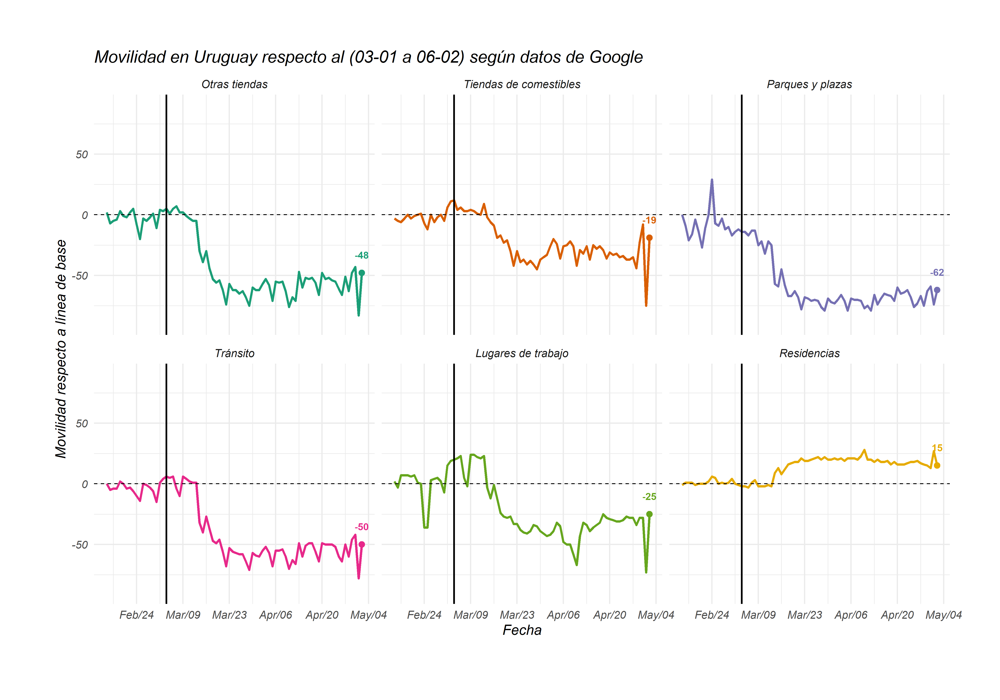
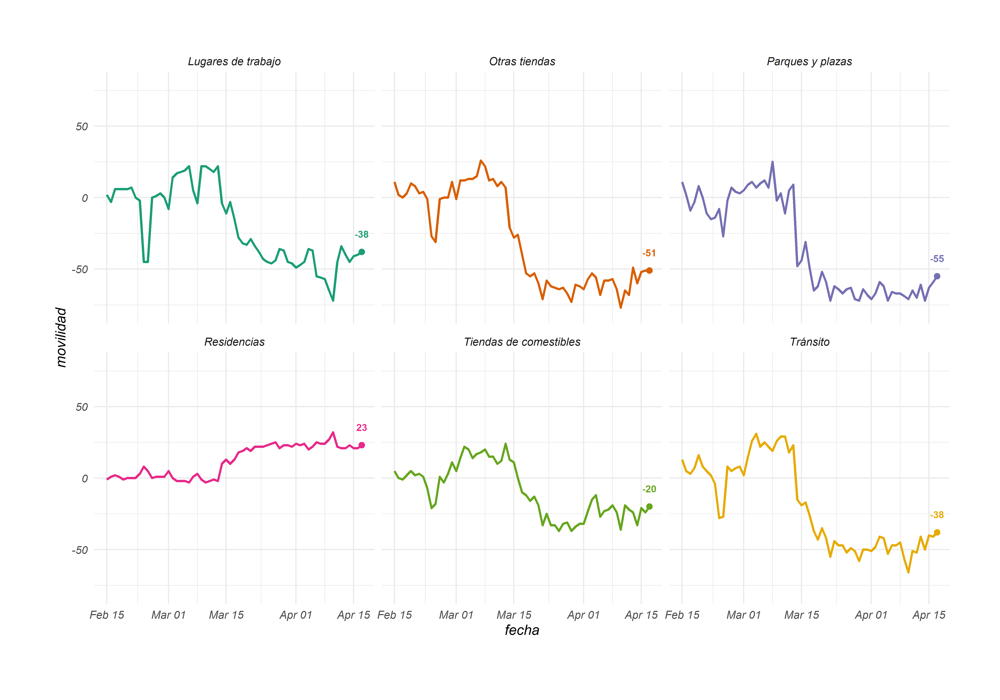

# mobility-uruguay
## Script de R para descargar y graficar datos de Google de movilidad en Uruguay

### Instalar y cargar paquetes 
`````````
install.packages("plyr")
install.packages("tidyverse")
install.packages("ggplot2")
remotes::install_github("kjhealy/covdata")

library(plyr)
library(covdata)
library(ggplot2)
library(tidyverse)
`````````

El siguiente código de R tiene como objetivo facilitar y automatizar el procesamiento de estos datos que Google reporta diariamente. Google elabora un reporte semanal con el procesamiento de estos datos (para acceder al último click [aquí](https://www.gstatic.com/covid19/mobility/2020-04-17_UY_Mobility_Report_en.pdf)), este código facilita el análisis de estos datos diariamente. Por información más detallada de la metodología con la que se recabaron estos datos click [aquí](https://www.google.com/covid19/mobility/). 

El paquete "covdata" nos permite descargar la información directamente desde R. 
La base de datos "uru" contiene los cambios en movilidad respecto a la mediana de actividad (de cada día de la semana) entre el 3 de enero y el 6 de febrero para Uruguay en su conjunto y cada departamento por separado.

``
uru <-google_mobility %>%
  filter(country_region_code == "UY")
``

Luego traducimos los nombres de variables y categorías

`````
uru <- uru %>% 
  rename(movilidad = pct_diff, tipo = type, fecha = date, pais = country_region, codigo_pais = country_region_code)

uru$tipo <- revalue(uru$tipo, c("grocery"="Tiendas de comestibles", "parks"="Parques y plazas", "residential" = "Residencias",
                                "retail" = "Otras tiendas", "transit" = "Tránsito", "workplaces" = "Lugares de trabajo"))
`````

La base creada "uru_gral" contiene tiene información solo para Uruguay en su conjunto (sin desagregar por departamento)

`
uru_gral <- uru %>% filter(is.na(sub_region_1))
`

Luego graficamos la estimación de movilidad para el total de Uruguay

````````
plot1 <- ggplot(uru_gral, aes(fecha, movilidad, colour = tipo)) +
  geom_line(linetype = "solid", size=1.3) +
  geom_point(data = uru_gral[uru_gral$fecha == max(uru_gral$fecha),],
             aes(x =fecha, color = tipo), show.legend = FALSE, size=3)+
  geom_text(data = uru_gral[uru_gral$fecha == max(uru_gral$fecha),],
            aes(x =fecha, label=movilidad,
            vjust = -2, fontface = "bold"))+ 
  facet_wrap(~ tipo) + theme_minimal(base_size = 16) + 
  theme(legend.position="none", plot.margin=unit(c(2,2,2.5,2.2),"cm")) + ylim(-80, 80)
plot1 + scale_color_brewer(palette="Dark2")
````````



Para exportar el gráfico:

``
setwd()
ggsave(file="movilidad_uruguay.png",width = 40, height = 28, units = "cm")
``

También podemos exportar la base en formato excel

`
write_xlsx(uru_gral, "uruguay_movilidad.xlsx")
`

Después filtramos la base por Montevideo y repetimos el procedimiento 

`
mvd <- uru %>% filter(sub_region_1 == "Montevideo Department")
`




