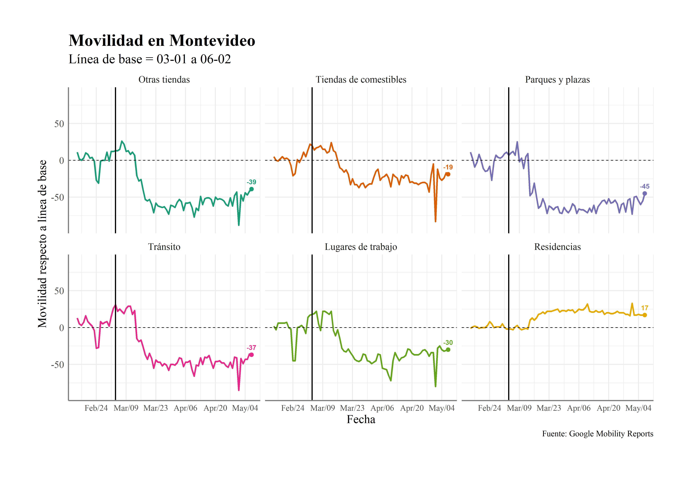
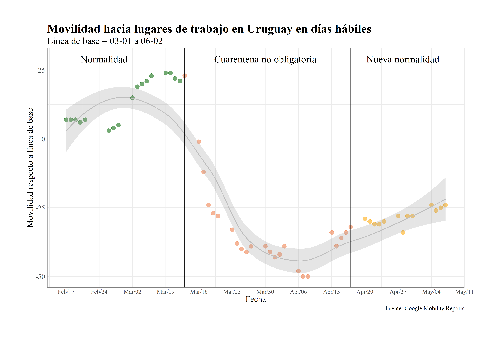

# mobility-uruguay
## Script de R para procesar y graficar datos de Google de movilidad en Uruguay

### Instalar y cargar paquetes 
`````````
install.packages("plyr")
install.packages("tidyverse")
install.packages("ggplot2")
install.packages("writexl")
install.packages("data.table")

library(plyr)
library(ggplot2)
library(tidyverse)
library(writexl)
library(data.table)
`````````

El siguiente código de R tiene como objetivo facilitar y automatizar el procesamiento de datos de movilidad que Google reporta. Google elabora un reporte semanal con un procesamiento sencillo de estos datos (para acceder al último click [aquí](https://www.gstatic.com/covid19/mobility/2020-04-17_UY_Mobility_Report_en.pdf)).  Por información más detallada de la metodología con la que se recabaron estos datos click [aquí](https://www.google.com/covid19/mobility/). 

Primero descargamos el csv que reporta Google [aquí](https://www.google.com/covid19/mobility/)

Importamos el archivo .csv con los datos para todos los países
`````
setwd()
google_mobility <- read.csv("Global_Mobility_Report.csv")
`````

Luego nos quedamos con los datos de Uruguay únicamente y obtenemos la base de datos "uru" que contiene los cambios en movilidad respecto a la mediana de actividad (de cada día de la semana) entre el 3 de enero y el 6 de febrero para Uruguay en su conjunto y cada departamento por separado. La línea vertical corresponde al día en que se detectan los primeros casos de coronavirus en Uruguay.

`````
uru <-google_mobility %>%
  filter(country_region_code == "UY")
`````

Luego limpiamos la base, y traducimos los nombres de variables y categorías

`````
uru$sub_region_2<-NULL
uru_reshape <- melt(setDT(uru), id.vars = c("date", "country_region","country_region_code","sub_region_1"), variable.name = "tipo")
uru_reshape$tipo <- revalue(uru_reshape$tipo, c("grocery_and_pharmacy_percent_change_from_baseline"="Tiendas de comestibles", 
                                "parks_percent_change_from_baseline"="Parques y plazas", 
                                "residential_percent_change_from_baseline" = "Residencias",
                                "retail_and_recreation_percent_change_from_baseline" = "Otras tiendas", 
                                "transit_stations_percent_change_from_baseline" = "Tránsito",
                                "workplaces_percent_change_from_baseline" = "Lugares de trabajo"))
uru_reshape <- uru_reshape %>% rename(fecha=date, movilidad = value)
colnames(uru_reshape)
uru_reshape$fecha <- as.Date(uru_reshape$fecha, "%Y-%m-%d")

`````

La base creada "uru_reshape" contiene tiene información solo para Uruguay en su conjunto (sin desagregar por departamento)
`
uru_gral <- uru_reshape %>% filter(sub_region_1=="")
`

Luego graficamos la estimación de movilidad para el total de Uruguay

````````
plot1 <- ggplot(uru_gral, aes(fecha, movilidad, colour = tipo)) +
  geom_line(linetype = "solid", size=1.3) +
  geom_point(data = uru_gral[uru_gral$fecha == max(uru_gral$fecha),],
             aes(x =fecha, color = tipo), show.legend = FALSE, size=3)+
  geom_text(data = uru_gral[uru_gral$fecha == max(uru_gral$fecha),],
            aes(x =fecha, label=movilidad,
                vjust = -2, fontface = "bold"))+ 
  facet_wrap(~ tipo) + theme_minimal(base_size = 20) + 
  theme(legend.position="none", plot.margin=unit(c(2,2,2.5,2.2),"cm"),
        text=element_text(size=16,  family="Times New Roman"), 
        plot.title = element_text(size=28, face="bold"), 
        axis.line = element_line(colour = "grey50", size = 1),
        strip.text = element_text(size=16),
        axis.title  = element_text(size=20),
        plot.subtitle = element_text(size=22),
        plot.caption = element_text(size=14),
        axis.text.x = element_text(size=14),
        axis.text.y = element_text(size=16)) + 
  geom_hline(yintercept=0, linetype="dashed",) +
  geom_vline(xintercept=as.numeric(uru_gral$fecha[19]), size=1) +  ylim(-90, 90) +
  scale_x_date(date_labels = "%b/%d", date_breaks = "2 weeks") +
  labs(x = "Fecha", y = "Movilidad respecto a línea de base", 
       title = "Movilidad en Uruguay",
       subtitle = "Línea de base = 03-01 a 06-02",
       caption = "Fuente: Google Mobility Reports")

plot1 + scale_color_brewer(palette="Dark2")
````````


Para exportar el gráfico:

```
setwd()
ggsave(file="movilidad_uruguay.png",width = 40, height = 28, units = "cm")
```

También podemos exportar la base en formato excel

`
write_xlsx(uru_gral, "uruguay_movilidad.xlsx")
`

Después filtramos la base por Montevideo y repetimos el procedimiento 

`
mvd <- uru %>% filter(sub_region_1 == "Montevideo Department")
`



Luego vamos a tratar de sacar un poco el ruido de la serie y agregarle información, particularmente al mirar movilidad hacia lugares de trabajo. Para ello eliminamos los fines de semana y feriados. También dividimos los datos en 3 etapas: normalidad (previo a los primeros casos de coronavirus en Uruguay), cuarentena no obligatoria (luego de la detección de los primero casos hasta la conferencia de prensa donde se introduce el concepto de "nueva normalidad" y la nueva normalidad. 

````````
uru_trab <- uru_gral %>% filter(tipo=="Lugares de trabajo")
uru_trab$entresemana <- !(weekdays(as.Date(uru_trab$fecha)) %in% c('Saturday','Sunday')) 
uru_trab <- uru_trab %>% filter(entresemana=="TRUE")
uru_trab <- uru_trab %>% filter(!fecha=="2020-05-01")
uru_trab <- uru_trab %>% filter(!fecha=="2020-02-24")
uru_trab <- uru_trab %>% filter(!fecha=="2020-02-25")
uru_trab <- uru_trab %>% filter(!fecha=="2020-04-09")
uru_trab <- uru_trab %>% filter(!fecha=="2020-04-10")

uru_trab$etapa <- "Cuarentena no obligatoria"
uru_trab$etapa <- ifelse(uru_trab$fecha < as.POSIXct("2020-03-13"), "Normalidad", uru_trab$etapa)
uru_trab$etapa <- ifelse(uru_trab$fecha > as.POSIXct("2020-04-17"), "Nueva normalidad", uru_trab$etapa)
uru_trab$etapa <- factor(uru_trab$etapa, c("Normalidad", "Cuarentena no obligatoria", "Nueva normalidad"), ordered=TRUE)
````````

Para graficar esto cambiamos un poco el formato del gráfico:

````````
plot3 <- ggplot(uru_trab, aes(fecha, movilidad, color=etapa)) +
  geom_point(aes(colour=etapa, alpha = 0.5, size = 4)) +
  geom_smooth(colour="Grey",alpha=.25,method = "loess",  se = T)+
  theme_minimal() + 
  theme(legend.position="none", plot.margin=unit(c(2,2,2.5,2.2),"cm"),
        text=element_text(size=16,  family="Times New Roman"), 
        plot.title = element_text(size=28, face="bold"), 
        axis.line = element_line(colour = "grey50", size = 1),
        strip.text = element_text(size=16),
        axis.title  = element_text(size=20),
        plot.subtitle = element_text(size=22),
        plot.caption = element_text(size=14),
        axis.text.x = element_text(size=14),
        axis.text.y = element_text(size=16)) + 
  geom_hline(yintercept=0, linetype="dashed",) +
  geom_vline(xintercept = as.numeric(as.Date("2020-03-13"))) + 
  geom_vline(xintercept = as.numeric(as.Date("2020-04-17"))) +
  annotate(geom="text",x=as.Date("2020-02-25"), y=29,label="Normalidad", size=8, family="Times New Roman") +
  annotate(geom="text",x=as.Date("2020-03-30"), y=29,label="Cuarentena no obligatoria", size=8, family="Times New Roman") +
  annotate(geom="text",x=as.Date("2020-04-28"), y=29,label="Nueva normalidad", size=8, family="Times New Roman") +
  scale_x_date(date_labels = "%b/%d", date_breaks = "1 week") +
  labs(x = "Fecha", y = "Movilidad respecto a línea de base", 
       title = "Movilidad hacia lugares de trabajo en Uruguay en días hábiles",
       subtitle = "Línea de base = 03-01 a 06-02",
       caption = "Fuente: Google Mobility Reports")

plot3 + scale_color_manual(values=c("darkgreen", "sienna2", "orange")) 
````````





